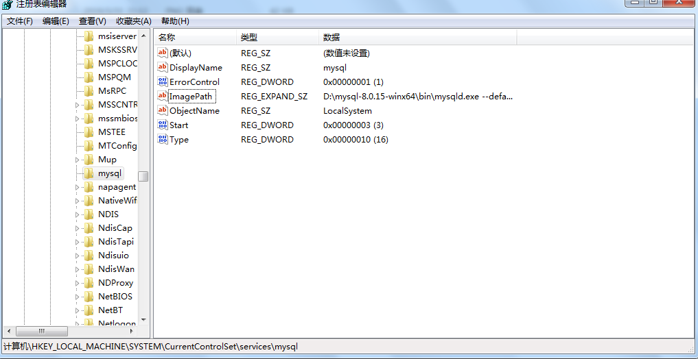
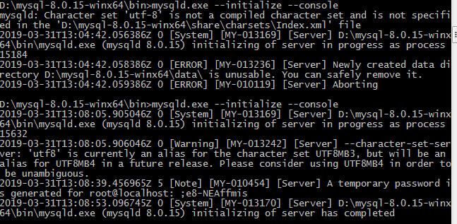

# 一、安装

### 环境说明

OS：Windows
MySQL：mysql-8.0.15-winx64

### 安装教程 (http://www.runoob.com/mysql/mysql-install.html)

### 遇到问题

* 系统错误，2，找不到文件，解决办法如下（特别说明：以前安装过，重新安装后，已有的服务路径是原来才导致此问题）



### my.ini（特别说明：utf8字符，非utf-8）

```
[mysql]
default-character-set=utf8

[mysqld]
port=3306

basedir=D:/mysql-8.0.15-winx64

max_connections=20

character-set-server=utf8

default-storage-engine=INNODB
```

# 二、用户

安装结束后，会生成root密码，记录并在第一次进入之后修改密码。



使用root进入数据库

```
mysql -h 主机名 -u 用户名 -p
```

修改root密码

```
alert user 'root'@'localhost' identified by 'xxxx'
```

创建用户

```
create user wds@'%' identified by 'xxxx'

```

# 三、SQL练习

```
//创建数据库
create database 'dbtest';

//授权
grant all privileges on dbtest.* to xxxx;

//创建表
CREATE TABLE email (
ID INT NOT NULL PRIMARY KEY,
Email VARCHAR(255)
)

CREATE TABLE World (
name VARCHAR(50) NOT NULL,
continent VARCHAR(50) NOT NULL,
area INT NOT NULL,
population INT NOT NULL,
gdp INT NOT NULL
);

//插入数据
INSERT INTO email VALUES('1','a@b.com');
INSERT INTO email VALUES('2','c@d.com');
INSERT INTO email VALUES('3','a@b.com');

INSERT INTO World
  VALUES('Afghanistan','Asia',652230,25500100,20343000);
INSERT INTO World 
  VALUES('Albania','Europe',28748,2831741,12960000);
INSERT INTO World 
  VALUES('Algeria','Africa',2381741,37100000,188681000);
INSERT INTO World
  VALUES('Andorra','Europe',468,78115,3712000);
INSERT INTO World
  VALUES('Angola','Africa',1246700,20609294,100990000);
```
