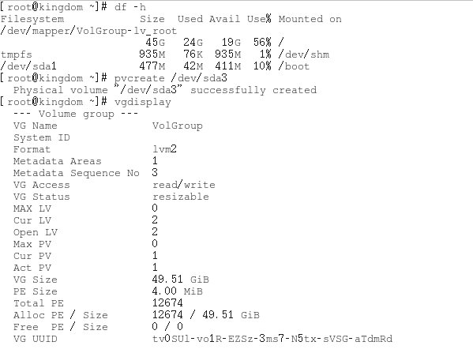

### 1 VMware中增加磁盘空间

首先在打开虚拟机设置，在选中硬盘选项，选择扩展选项（expand），设置扩展大小（需要关机状态，并且不能有虚拟机快照），比如我原来是20G ，通过设置扩展到40G。这一步过后linux就多了20G空闲磁盘。

但这只是Vmware给该虚拟机分了硬盘，就像你加了块硬盘到电脑上，下面还要在linux系统中配置使硬盘空间正确挂载。

### 2 挂载

终端输入 > fdisk /dev/sda      

然后输入“p”（print分区信息）  查看当前信息 

（对本地sda硬盘进行分区管理，其中sda是指SATA接口的硬盘,一般sda一般指第一块硬盘，第二块是sdb。相应的hda一般是指IDE接口的硬盘.）

此时一般只有sda1、sda2两个分区，所以需要为添加的磁盘新建一个新分区:

还是在fdisk command里输入“n” （new一个新分区）此时进入扩展、主分区的选择，输入“p”选择主分区,并且选择分区号为3。

最后会提示选择该分区的起始地址和结束地址，一般选默认的即可。此时再次输入p就可以看到已经分好区的sda3了 

**备注**：此时输入w（write写入）保存分区结果，然后重启或者输入> partprobe /dev/sda3更新一下分区信息。

### 3 扩展逻辑卷

这一步进行扩展LVM（逻辑卷）:

先 输入 > pvcreate /dev/sda3  创建物理卷 PV （Physical volume）。

在这可以输入 > vgdisplay，查看下当前的卷组（volumegroup）

输入> vgextend /dev/mapper/vg_name  /dev/sda3  将新的pv加入到原有的vg: 

提示Success表示成功，其中，vg的名称是自己系统的vg名称，可以通过df –h 查看

扩大当前正在使用的（根文件系统）逻辑卷LV，从vg中取剩下的空间这里是20G，但是有保留地址，直接取20G会报错，所以我这里取了19G：

命令是：> lvextend -l + xxG  /dev/mapper/vg_name-lv_root

最后  输入命令:  > resize2fs  dev/mapper/vg_name-lv_root

这一步重新刷新了文件系统大小，之后再次df查看一下，就可以看到当前根文件系统已经是37G了。

### 4 所有操作命令图

